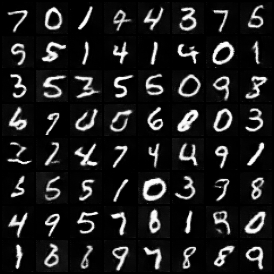
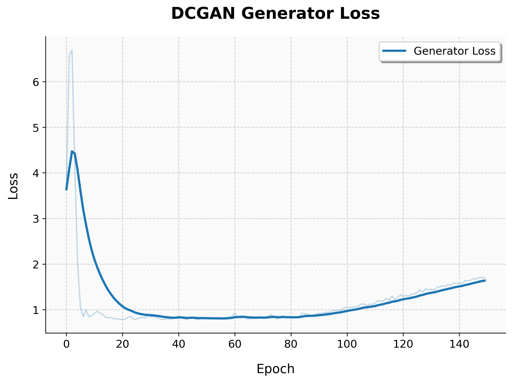
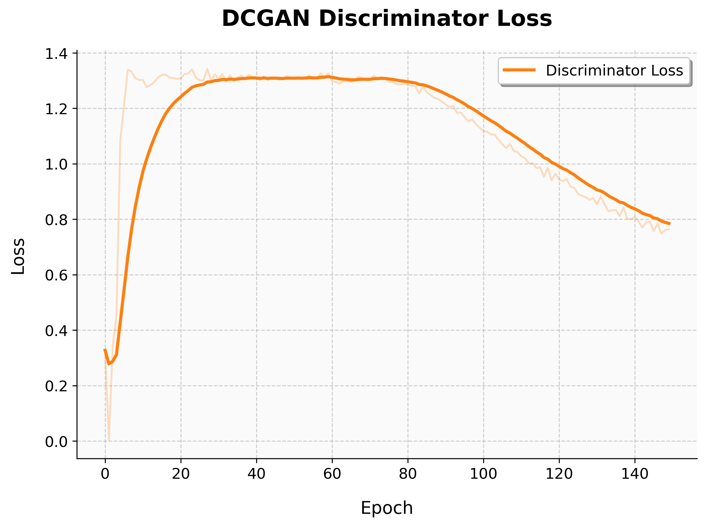
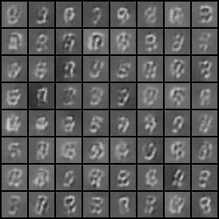
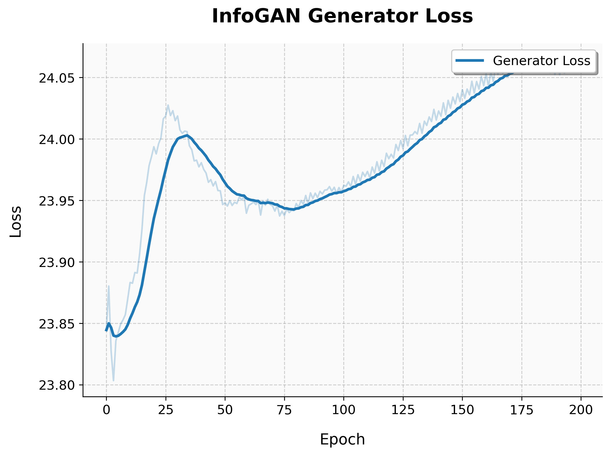
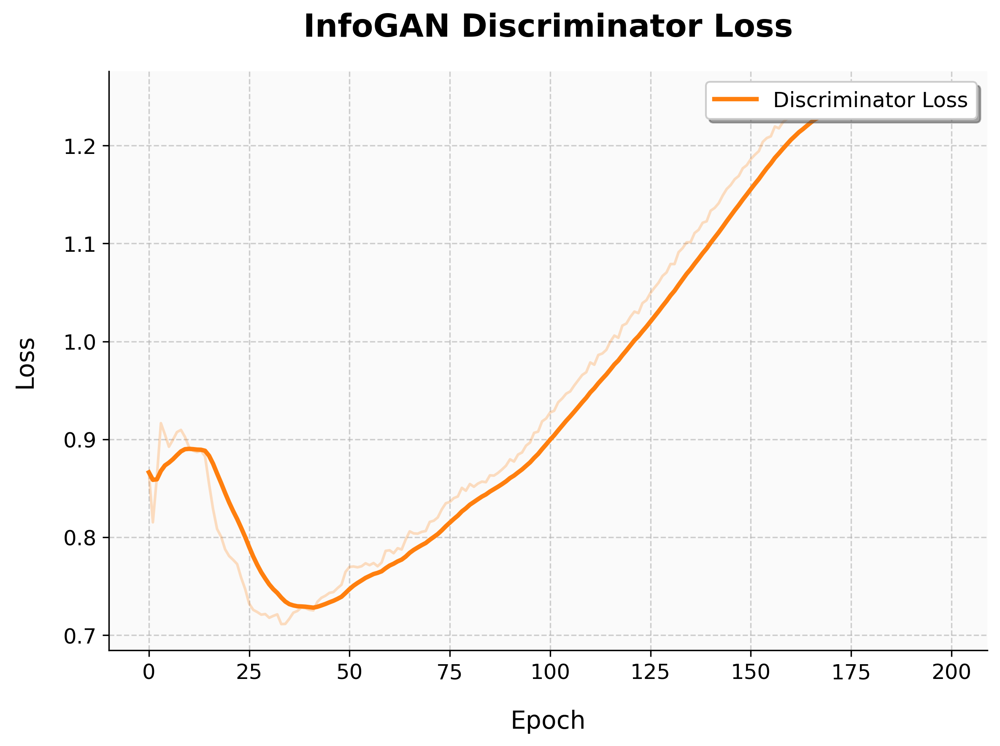

# GiGANtic

<p align="center">
    
</p>

GiGANtic is a Generative Adversarial Network library with multiple Pytorch implementations of them: Wasserstein GAN with weight clipping (WGAN) and gradient penalty (WGAN-GP), Deep Convolutional GAN (DC-GAN), InfoGAN and Energy Based GAN (EBGAN)

## 🚀 Setup 

Create a virtual environment and install the dependencies:

```bash
pip install -r requirements.txt
```

## 🦾 Training

To train a model run:

```bash
python train.py --model <MODEL_NAME> --epochs <EPOCHS> --batch_size <BATCH_SIZE> 
```
Available model names are: 
- DCGAN 
- WGAN for Wasserstein GAN with weight clipping
- WGAN with --gradient-penalty flag for Wasserstein GAN with gradient penalty
- InfoGAN
- EBGAN

To resume training from an epoch number N use the --resume_checkpoint flag:

```bash
python train.py --model <MODEL_NAME> --epochs <EPOCHS> --batch_size <BATCH_SIZE> --resume_checkpoint <N>
```

where EPOCHS > N so that the training is done till the total number EPOCHS is reached

## 📈 Results on MNIST dataset

All models were trained on 26365 steps (around 58 steps per epoch * 450 epochs)

### DCGAN
Trained with 150 epochs and batch size of 1024. The final image and training gif are the following:

<table>
  <tr>
    <td>
      
    </td>
    <td>
      
    </td>
  </tr>
</table>

And the generator loss and discriminator loss plots:
<table>
  <tr>
    <td>
      
    </td>
    <td>
      
    </td>
  </tr>
</table>

### WGAN
Trained with 300 epochs and batch size of 1024

### WGAN-GP

### InfoGAN
Trained with 200 epochs and batch size of 1024. The final image and training gif are the following:

<table>
  <tr>
    <td>
      
    </td>
    <td>
      
    </td>
  </tr>
</table>
And the generator loss and discriminator loss plots:
<table>
  <tr>
    <td>
      
    </td>
    <td>
      
    </td>
  </tr>
</table>

### EBGAN

