# GiGANtic

<p align="center">
    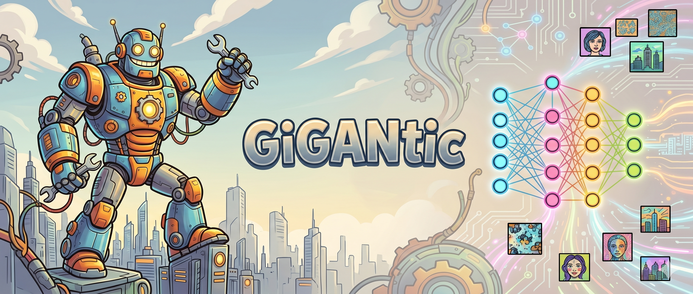
</p>

GiGANtic is a Generative Adversarial Network library with multiple Pytorch implementations of them. The implemented models are: Wasserstein GAN with weight clipping (WGAN), Deep Convolutional GAN (DC-GAN), InfoGAN and Energy Based GAN (EBGAN).

## 🚀 Setup 

Create a virtual environment and install the dependencies:

```bash
pip install -r requirements.txt
```

Log in to wandb by running in the terminal and following the instructions of:
```bash
wandb login
``` 


## 🦾 Training

To train a model run:

```bash
python train.py --model <MODEL_NAME> --epochs <EPOCHS> --batch_size <BATCH_SIZE> --checkpoint_dir <CHECKPOINT_DIR>
```
Available model names are: 
- DCGAN 
- WGAN for Wasserstein GAN with weight clipping
- InfoGAN
- EBGAN

To resume training from an epoch number N use the --resume_checkpoint flag:

```bash
python train.py --model <MODEL_NAME> --epochs <EPOCHS> --batch_size <BATCH_SIZE> --checkpoint_dir <CHECKPOINT_DIR> --resume_checkpoint <N> 
```

where EPOCHS > N so that the training is done till the total number EPOCHS is reached

## 📈 Results on MNIST Dataset

Qualitative evaluation and training dynamics across the implemented architectures on MNIST. Overall, EBGAN demonstrated the fastest convergence and highest sample quality, followed by DCGAN, InfoGAN and WGAN (weight clipping).

---

### DCGAN

- **Training Setup:** 150 epochs, batch size 1024.
- **Observations:** Converged in the fewest iterations while generating sharp, distinct digit representations with stable generator and discriminator loss dynamics.

<p align="center">
  
  
</p>

<details>
<summary><b>📈 Generator &amp; Discriminator Loss Plots</b></summary>
<br>
<p align="center">
  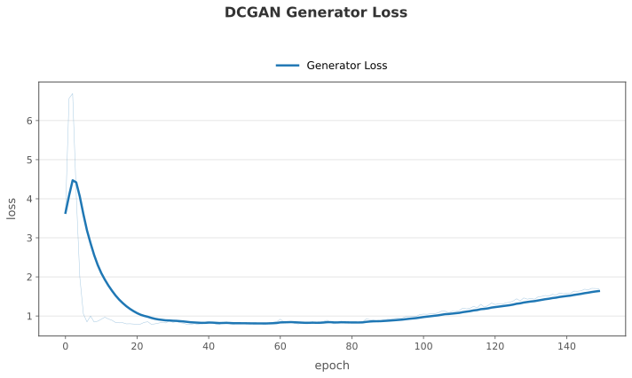
  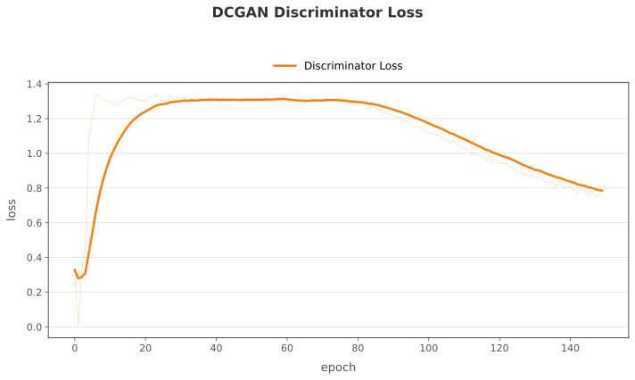
</p>
</details>

---

### WGAN (Weight Clipping)

- **Training Setup:** 550 epochs without bias / 500 epochs with bias, batch size 1024.
- **Observations:** Weight clipping restricted effective model capacity on smaller CNN architectures, requiring significantly more epochs to produce recognizable digits. Output quality plateaued around epoch 500, and enabling convolutional bias terms yielded negligible difference in visual fidelity or convergence.

#### Without Bias (550 Epochs)

<p align="center">
  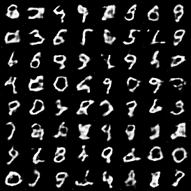
  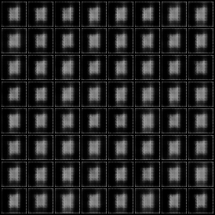
</p>

<details>
<summary><b>📈 Generator &amp; Discriminator Loss Plots (No Bias)</b></summary>
<br>
<p align="center">
  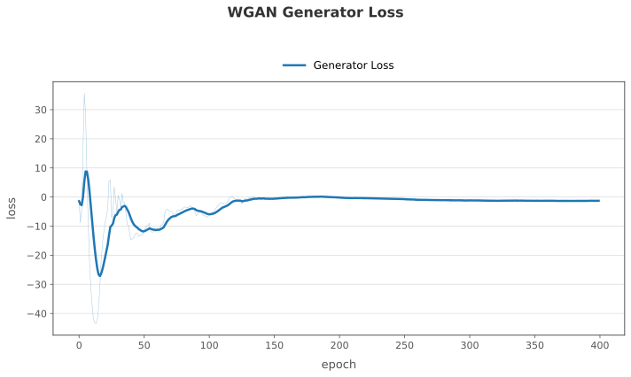
  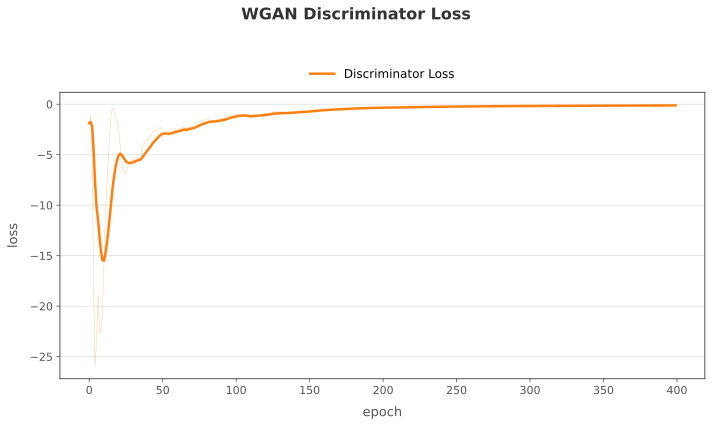
</p>
</details>

#### With Bias (500 Epochs)

<p align="center">
  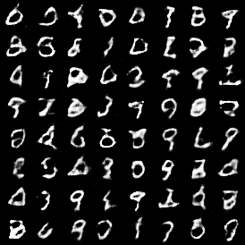
  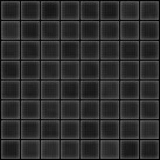
</p>

<details>
<summary><b>📈 Generator &amp; Discriminator Loss Plots (With Bias)</b></summary>
<br>
<p align="center">
  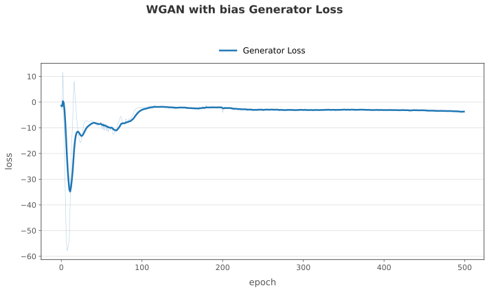
  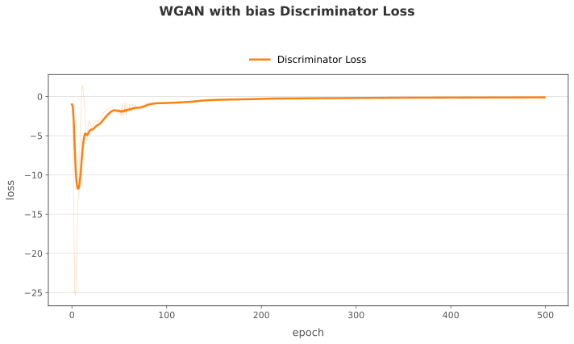
</p>
</details>

---

### InfoGAN

- **Training Setup:** 200 epochs, batch size 1024.
- **Observations:** Exhibits a distinctive learning dynamic by capturing foreground digit structure and background concurrently (unlike DCGAN's sequential learning). Sample quality continued improving through late epochs even as generator and discriminator losses trended upward, illustrating the frequent disconnect between GAN loss values and perceptual output quality.

<p align="center">
  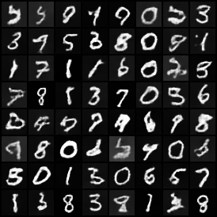
  
</p>

<details>
<summary><b>📈 Generator &amp; Discriminator Loss Plots</b></summary>
<br>
<p align="center">
  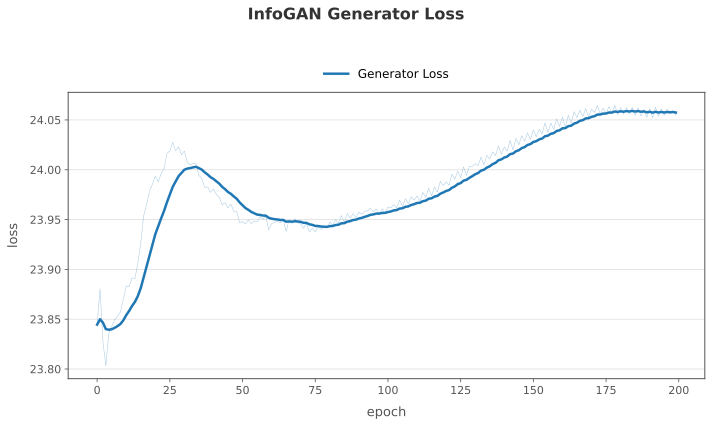
  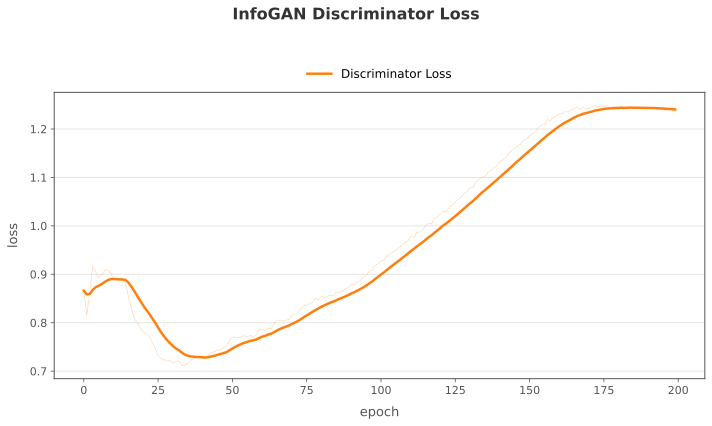
</p>
</details>

---

### EBGAN

- **Training Setup:** 225 epochs, batch size 1024.
- **Observations:** Demonstrated rapid initial convergence within the first 15 epochs. However, training stabilized and then began diverging around epoch 30, resulting in partial mode collapse where digits such as 2, 4, and 5 were largely omitted from generated batches.

<p align="center">
  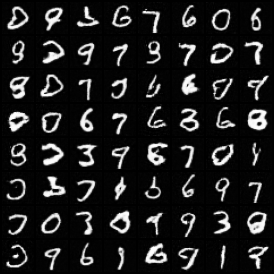
  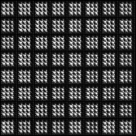
</p>

<details>
<summary><b>📈 Generator &amp; Discriminator Loss Plots</b></summary>
<br>
<p align="center">
  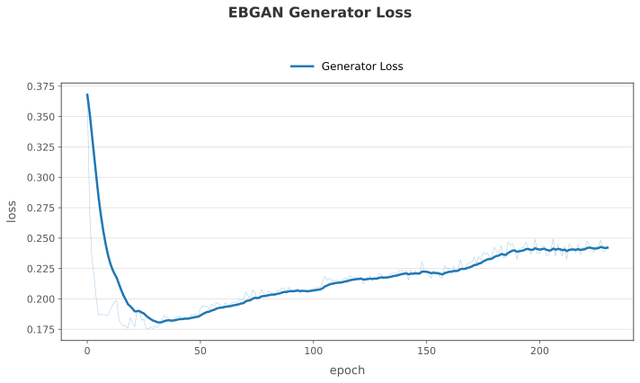
  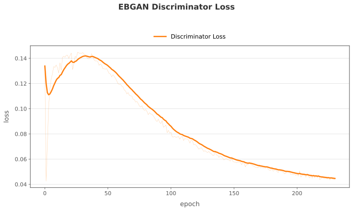
</p>
</details>

## ✒️ Appendix: GAN Objectives 

### 1. GAN Objective

The GAN objective is conceptually defined by a game between two players, the Discriminator and the Generator: we want the Discriminator to learn which images are real and which ones are fake at the same time that the Generator tries to fool the Discriminator. The formal definition is given by:

$$
\min_G \max_D V(D, G) = \mathbb{E}_{x \sim p_{data}} [\log D(x)] + \mathbb{E}_{z \sim p_z} [\log(1 - D(G(z)))]
$$

---

### 2. Derivation of the Optimal Discriminator $D^\ast$

To find the optimal discriminator, we analyze the original GAN value function $V(G,D)$ assuming a fixed generator $G$:

$$
V(G,D) = \int_{\mathcal{X}} p_{data}(x) \log D(x) + p_G(x) \log(1 - D(x)) \, dx
$$

Since we want to maximize this integral for each point $x$ in the domain $\mathcal{X}$, we focus on maximizing the integrand. That is, we want to maximize a function of the form:

$$
f(y) = a \log y + b \log(1-y)
$$

where we define $y = D(x)$ (our variable to optimize in the range $[0,1]$), $a = p_{data}(x)$, and $b = p_G(x)$.

To find the maximum, we calculate the derivative with respect to $y$ and set it to zero:

$$
f'(y) = \frac{a}{y} - \frac{b}{1-y} = 0
$$

Rearranging the terms:

$$
\frac{a}{y} = \frac{b}{1-y}
$$

Cross-multiplying:

$$
a(1-y) = b y
$$

Expanding the left side:

$$
a - a y = b y
$$

Grouping the terms with $y$:

$$
a = y(a+b)
$$

Solving for $y$:

$$
y = \frac{a}{a+b}
$$

Returning to our original variables, we conclude that the optimal discriminator is:

$$
D^\ast(x) = \frac{p_{data}(x)}{p_{data}(x) + p_G(x)}
$$

---

### 3. Proof of the Jensen-Shannon Divergence

Now that we know the optimal discriminator $D^\ast(x)$, we replace it in the objective function to see what the generator is actually minimizing:

$$
\mathbb{E}_{x \sim p_{data}} [\log D^\ast(x)] + \mathbb{E}_{z \sim p_z} [\log (1 - D^\ast(G(z)))]
$$

Replacing the definition of $D^\ast(x)$:

$$
\mathbb{E}_{x \sim p_{data}} \left[\log \frac{p_{data}(x)}{p_{data}(x) + p_G(x)}\right] + \mathbb{E}_{z \sim p_z} \left[\log \left(1 - \frac{p_{data}(G(z))}{p_{data}(G(z)) + p_G(G(z))}\right)\right]
$$

Simplifying the fraction inside the second logarithm:

$$
\mathbb{E}_{x \sim p_{data}} \left[\log \frac{p_{data}(x)}{p_{data}(x) + p_G(x)}\right] + \mathbb{E}_{z \sim p_z} \left[\log \left(\frac{p_{data}(G(z)) + p_G(G(z)) - p_{data}(G(z))}{p_{data}(G(z)) + p_G(G(z))}\right)\right]
$$

Canceling out the $p_{data}(G(z))$ terms:

$$
\mathbb{E}_{x \sim p_{data}} \left[\log \frac{p_{data}(x)}{p_{data}(x) + p_G(x)}\right] + \mathbb{E}_{z \sim p_z} \left[\log \frac{p_G(G(z))}{p_{data}(G(z)) + p_G(G(z))}\right]
$$

Applying the Change of Variable Theorem (if $z \sim p_z$ and $x = G(z)$, then $x \sim p_G$):

$$
\mathbb{E}_{x \sim p_{data}} \left[\log \frac{p_{data}(x)}{p_{data}(x) + p_G(x)}\right] + \mathbb{E}_{x \sim p_G} \left[\log \frac{p_G(x)}{p_{data}(x) + p_G(x)}\right]
$$

Multiplying and dividing the denominators by 2 to introduce the concept of an average distribution:

$$
\mathbb{E}_{x \sim p_{data}} \left[\log \frac{p_{data}(x)}{\frac{p_{data}(x) + p_G(x)}{2} \cdot 2}\right] + \mathbb{E}_{x \sim p_G} \left[\log \frac{p_G(x)}{\frac{p_{data}(x) + p_G(x)}{2} \cdot 2}\right]
$$

Applying the logarithm property $\log(\frac{A}{2B}) = \log(\frac{A}{B}) - \log 2$:

$$
\mathbb{E}_{x \sim p_{data}} \left[\log \frac{p_{data}(x)}{\frac{p_{data}(x) + p_G(x)}{2}}\right] + \mathbb{E}_{x \sim p_G} \left[\log \frac{p_G(x)}{\frac{p_{data}(x) + p_G(x)}{2}}\right] - 2\log 2
$$

Defining the average distribution $M(x) = \frac{p_{data}(x) + p_G(x)}{2}$:

$$
\mathbb{E}_{x \sim p_{data}} \left[\log \frac{p_{data}(x)}{M(x)}\right] + \mathbb{E}_{x \sim p_G} \left[\log \frac{p_G(x)}{M(x)}\right] - 2\log 2
$$

Recognizing the definition of the Kullback-Leibler Divergence, $D_{KL}(P \parallel Q) = \sum_{\mathcal{X}} P(x) \log \frac{P(x)}{Q(x)} = \mathbb{E}_{x \sim P} \left[\log \frac{P(x)}{Q(x)}\right]$:

$$
D_{KL}(p_{data} \parallel M) + D_{KL}(p_G \parallel M) - 2\log 2
$$

Finally, applying the definition of the Jensen-Shannon Divergence, $D_{JS}(P \parallel Q) = \frac{1}{2} D_{KL}(P \parallel M) + \frac{1}{2} D_{KL}(Q \parallel M)$:

$$
2 D_{JS}(p_{data} \parallel p_G) - 2\log 2
$$

With this, we can see that when the Discriminator is optimal, we are approximating the Jensen-Shannon Divergence between the real and fake distributions. Since the JS Divergence is always non-negative (because it's a symmetric KL divergence with always a finite value because it doesn't depend on the overlap of the two distributions), the minimum value is 0, that is achieved when the two distributions are identical. If we were to reach that state, the Generator would have perfectly learned the data distribution. 

---

### 4. WGAN & WGAN-GP

The WGAN objective is quite different from the DCGAN one. Instead of using Binary Cross Entropy to solve the minimax problem, it uses the Wasserstein-1 distance (also known as the Earth Mover's Distance) to measure the distance between the real and generated distributions:

$$
W(p_r, p_g) = \inf_{\gamma \in \Pi(p_r, p_g)} \mathbb{E}_{(x,y) \sim \gamma} [\|x-y\|_2] = \inf_{\gamma \in \Pi(p_r, p_g)} \iint \|x-y\|_2 \, \gamma(x, y) \, dx \, dy
$$

where $\Pi(p_r, p_g)$ denotes the set of all joint distributions $\gamma(x, y)$ whose marginals are $p_r$ and $p_g$. This metric represents the minimum cost of transporting probability mass to transform distribution $p_r$ into $p_g$.

In high-dimensional spaces, evaluating the infimum over all joint distributions is intractable. By the Kantorovich-Rubinstein duality, the objective can be reformulated as:

$$
\min_G \max_{D \in \mathcal{D}_L} \mathbb{E}_{x \sim p_{data}} [D(x)] - \mathbb{E}_{z \sim p_z} [D(G(z))]
$$

where $\mathcal{D}_L$ is the family of $K$-Lipschitz continuous functions satisfying:

$$
|D(x_1) - D(x_2)| \le K \|x_1 - x_2\|_2 \quad \Longleftrightarrow \quad \|\nabla_x D(x)\|_2 \le K
$$

To enforce the 1-Lipschitz ($K=1$) constraint on the critic $D$, two primary methods exist:

#### 1. Weight Clipping (WGAN)
Forces all network parameters $w$ to lie within a compact metric space $[-c, c]$ after every gradient update:

$$
w \leftarrow \mathrm{clamp}(w, -c, c)
$$

While simple, weight clipping often leads to vanishing/exploding gradients and underutilization of the network capacity.

#### 2. Gradient Penalty (WGAN-GP)
Penalizes the norm of the critic's gradient with respect to interpolated samples $\hat{x}$ directly in the loss function:

$$
\mathcal{L}_{critic} = \underbrace{\mathbb{E}_{\tilde{x} \sim p_g}[D(\tilde{x})] - \mathbb{E}_{x \sim p_{data}}[D(x)]}_{\text{Standard WGAN Critic Loss}} + \underbrace{\lambda \, \mathbb{E}_{\hat{x} \sim p_{\hat{x}}} \left[ \left( \|\nabla_{\hat{x}} D(\hat{x})\|_2 - 1 \right)^2 \right]}_{\text{Gradient Penalty Term}}
$$

where $\hat{x} = \epsilon x + (1 - \epsilon) \tilde{x}$ for $\epsilon \sim U(0, 1)$ interpolating uniformly along straight lines between real and generated points, and $\lambda$ is the penalty coefficient (commonly $\lambda = 10$).

---

### 5. InfoGAN

In standard GANs, the generator uses the latent noise vector $z$ in an arbitrary, entangled manner: individual dimensions of $z$ rarely correspond to identifiable semantic attributes of the data (such as digit identity, rotation, or line thickness). 

InfoGAN solves this issue in an unsupervised way by decomposing the input noise into two components:
1. An incompressible noise vector $z \sim p_z(z)$.
2. A structured latent code vector $c = (c_1, c_2, \dots, c_L) \sim p(c)$, which can include discrete (categorical) and continuous variables.

#### Information-Theoretic Regularization
To prevent the generator from ignoring the latent codes $c$, InfoGAN maximizes the Mutual Information $I(c; G(z, c))$ between the latent codes $c$ and the generated distribution $G(z, c)$. The minimax objective is defined as:

$$
\min_G \max_D V_I(D, G) = V(D, G) - \lambda I(c; G(z, c))
$$

where $V(D, G)$ is the standard GAN value function, and $\lambda > 0$ is a regularization hyperparameter.

#### Variational Information Maximization
In information theory, mutual information is defined as $I(X; Y) = H(X) - H(X \mid Y)$. For the generator's distribution:

$$
I(c; G(z, c)) = H(c) - H(c \mid G(z, c)) = \mathbb{E}_{x \sim G(z, c)} \left[ \mathbb{E}_{c' \sim P(c \mid x)} [\log P(c' \mid x)] \right] + H(c)
$$

Because evaluating the true posterior $P(c \mid x)$ is intractable, InfoGAN defines a variational lower bound by introducing an auxiliary distribution $Q(c \mid x)$ parameterized by an auxiliary neural network head ($Q$) sharing convolutional features with the discriminator $D$:

$$
I(c; G(z, c)) \ge L_I(G, Q) = \mathbb{E}_{c \sim P(c), \, x \sim G(z, c)} [\log Q(c \mid x)] + H(c)
$$

Since the prior distribution $P(c)$ is fixed during training, the entropy term $H(c)$ is constant, and the objective simplifies to maximizing $\mathbb{E}_{c \sim P(c), x \sim G(z, c)} [\log Q(c \mid x)]$.

#### Code Reconstruction Losses
The auxiliary network $Q(c \mid x)$ outputs predictions for each latent code:
- **Discrete / Categorical codes $c_{\text{disc}}$** (e.g. digit identity): Optimized via Cross-Entropy Loss:

$$
\mathcal{L}_{\text{disc}} = -\sum_{k} c_{\text{disc}, k} \log Q_k(x)
$$

- **Continuous codes $c_{\text{cont}}$** (e.g. slant, thickness): $Q$ parameterizes the mean $\mu(x)$ and log-variance $\log \sigma^2(x)$ of a factored Gaussian distribution, optimized via Gaussian Negative Log-Likelihood (GNLL):

$$
\mathcal{L}_{\text{cont}} = \frac{1}{2} \left[ \log \sigma^2(x) + \frac{(c_{\text{cont}} - \mu(x))^2}{\sigma^2(x)} \right]
$$

---

### 6. EBGAN

Energy-Based Generative Adversarial Networks (EBGAN) reinterpret the discriminator as an energy function $D(x) \in [0, +\infty)$ rather than a probability estimator $D(x) \in [0, 1]$. The energy function assigns low energy values to regions in data space where real samples reside, and higher energy values to other regions (unrealistic or fake samples).

#### Autoencoder Discriminator Architecture
In EBGAN, the discriminator is structured as an autoencoder consisting of an encoder $\mathrm{Enc}$ and a decoder $\mathrm{Dec}$. The energy assigned to an image $x$ is defined as its reconstruction Mean Squared Error (MSE):

$$
D(x) = \|x - \mathrm{Dec}(\mathrm{Enc}(x))\|_2^2
$$

Real images belonging to the data manifold are reconstructed with low error (low energy), whereas generated images that deviate from the manifold incur high reconstruction error (high energy).

#### Margin Loss Formulation
To train the discriminator and prevent the autoencoder from trivially learning to assign zero energy everywhere (the degenerate constant function), a positive margin $m > 0$ is introduced using a hinge loss:

$$
\mathcal{L}_D(x, z) = D(x) + [m - D(G(z))]^+ = D(x) + \max(0, \, m - D(G(z)))
$$

$$
\mathcal{L}_G(z) = D(G(z))
$$

- **Discriminator**: Minimizes the reconstruction energy $D(x)$ for real images while pushing the energy of generated images $D(G(z))$ to be at least $m$. The hinge $[m - D(G(z))]^+$ ensures that once fake images reach an energy $\ge m$, they produce zero gradient, preventing $D$ from dedicating unnecessary capacity to already unrealistic samples.
- **Generator**: Minimizes $D(G(z))$, training itself to produce images that the autoencoder can reconstruct with minimal error, effectively placing generated samples onto the low-energy real data manifold.

## 📖 References

1. **EBGAN** — Junbo Zhao, Michael Mathieu, Yann LeCun.  
   *Energy-based Generative Adversarial Network*. International Conference on Learning Representations (ICLR), 2017.  
   [[arXiv:1609.03126](https://arxiv.org/abs/1609.03126)] • [[OpenReview](https://openreview.net/forum?id=S1pEwZ5el)]
   <details>
   <summary>BibTeX</summary>

   ```bibtex
   @article{zhao2017energybased,
     author  = {Junbo Zhao and Michael Mathieu and Yann LeCun},
     title   = {Energy-based Generative Adversarial Network},
     journal = {International Conference on Learning Representations (ICLR)},
     year    = {2017}
   }
   ```
   </details>

2. **DCGAN** — Alec Radford, Luke Metz, Soumith Chintala.  
   *Unsupervised Representation Learning with Deep Convolutional Generative Adversarial Networks*. International Conference on Learning Representations (ICLR), 2016.  
   [[arXiv:1511.06434](https://arxiv.org/abs/1511.06434)]
   <details>
   <summary>BibTeX</summary>

   ```bibtex
   @article{radford2016unsupervised,
     author  = {Alec Radford and Luke Metz and Soumith Chintala},
     title   = {Unsupervised Representation Learning with Deep Convolutional Generative Adversarial Networks},
     journal = {International Conference on Learning Representations (ICLR)},
     year    = {2016}
   }
   ```
   </details>

3. **InfoGAN** — Xi Chen, Yan Duan, Rein Houthooft, John Schulman, Ilya Sutskever, Pieter Abbeel.  
   *InfoGAN: Interpretable Representation Learning by Information Maximizing Generative Adversarial Nets*. Advances in Neural Information Processing Systems (NeurIPS), 2016.  
   [[arXiv:1606.03657](https://arxiv.org/abs/1606.03657)]
   <details>
   <summary>BibTeX</summary>

   ```bibtex
   @article{chen2016infogan,
     author  = {Xi Chen and Yan Duan and Rein Houthooft and John Schulman and Ilya Sutskever and Pieter Abbeel},
     title   = {InfoGAN: Interpretable Representation Learning by Information Maximizing Generative Adversarial Nets},
     journal = {Advances in Neural Information Processing Systems (NeurIPS)},
     year    = {2016}
   }
   ```
   </details>

4. **WGAN** — Martin Arjovsky, Soumith Chintala, Léon Bottou.  
   *Wasserstein GAN*. International Conference on Machine Learning (ICML), 2017.  
   [[arXiv:1701.07875](https://arxiv.org/abs/1701.07875)]
   <details>
   <summary>BibTeX</summary>

   ```bibtex
   @article{arjovsky2017wasserstein,
     author  = {Martin Arjovsky and Soumith Chintala and L{\'e}on Bottou},
     title   = {Wasserstein GAN},
     journal = {International Conference on Machine Learning (ICML)},
     year    = {2017}
   }
   ```
   </details>

5. **WGAN-GP** — Ishaan Gulrajani, Faruk Ahmed, Martin Arjovsky, Vincent Dumoulin, Aaron Courville.  
   *Improved Training of Wasserstein GANs*. Advances in Neural Information Processing Systems (NeurIPS), 2017.  
   [[arXiv:1704.00028](https://arxiv.org/abs/1704.00028)]
   <details>
   <summary>BibTeX</summary>

   ```bibtex
   @article{gulrajani2017improved,
     author  = {Ishaan Gulrajani and Faruk Ahmed and Martin Arjovsky and Vincent Dumoulin and Aaron Courville},
     title   = {Improved Training of Wasserstein GANs},
     journal = {Advances in Neural Information Processing Systems (NeurIPS)},
     year    = {2017}
   }
   ```
   </details>